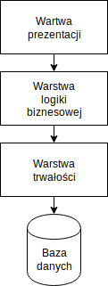
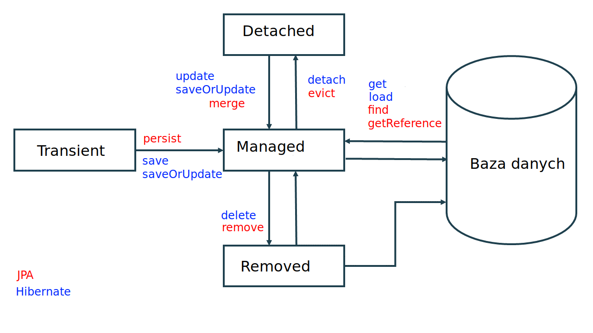
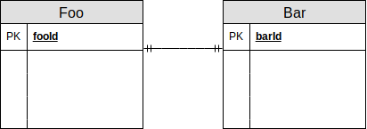
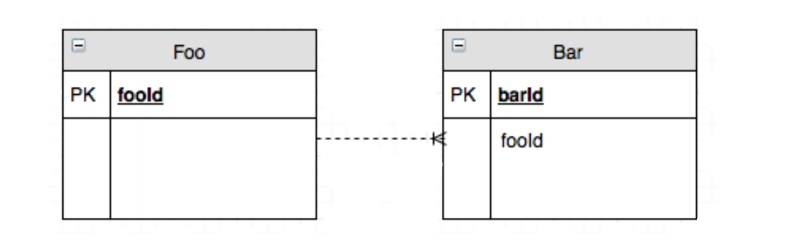
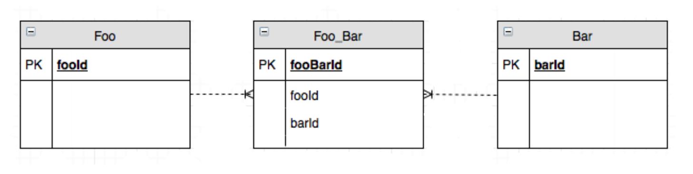
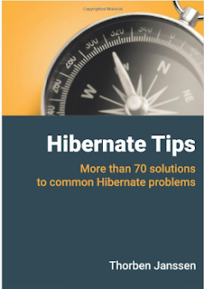

---

##### Czym jest Hibernate?

**Hiberate** to framework zapewniający implementację warstwy dostępu do danych (tak znanej *warstwy trwałości* czyli *persistence layer*) oraz translację danych z struktury relacyjnej na obiektową.

Ze wględu na to, że **Hibernate** zapewnia mapowanie danych z baz relacyjnych na obiekty jest nazywany frameworkiem **ORM** (*Object-Relational Mapping*).

**Hibernate** jest implementacją specyfikacji **JPA**&nbsp;(*ang. Java&nbsp;Persistance&nbsp;API*).


Note: Hibernate powstało w 2001, a JPA w 2006. Inne implementacje: iBatis, EclipseLink, OpenJPA. Istnieją też ORM nie implementujące JPA.

---

##### Architektura wartwowa

Termin *warstwa trwałości* (*persistance layer*) pochodzi z pojęcia **architektury n-wartwowej** (*ang. n-tier architecture*), gdzie naczęściej warstwy są trzy:



---

##### Co próbuje osiągnąć JPA/Hibernate?

 * rozwiązenie problemu niedopasowania światów relacyjnego i obiektowego
 * zapewnienie eleganckiej abstracji kodu odpowiedzialnego za zapis do bazy danych
 * stworzenie wspólnej warstwę abstrakcji nad różnymi systemami bazodanowymi

Note: problemy w wyznaczeniem identyczności, hierarchią podtypów, problem z odwzorowaniem asocjacji

---

##### Alternatywy?

 * ręczne stworzenie wartwy trwałości w **JDBC**.
 * użycie biblioteki, która rozwiązuje problemy związane z powtarzalnym kodem i przekształcaniem danych na obiekty, ale nie zapewnia mapowania relacyjno-obiektowego.

Note: Na przykład jooq, JdbcTemplate

---

#### W jaki sposób działa Hibernate?

---

##### Session

Egzemplarze interfejs **Session** to *lekkie* obiekty, a koszt ich utworzenia i zniszczenia jest niewielki.
Podczas działania aplikacji cały czas tworzy i usuwa obiekty **Session**, często używając je tylko do wykonania jednego zapytania.

##### SessionFactory

Zadaniem **SessionFactory** jest tworzenie egzemplarzy **Session**.
Najczęściej istnieje tylko jeden egzemplarz **SessionFactory**, ale jeżeli aplikacja łączy się z wieloma bazami danych na raz, to może istnieć ich wiele.


Note: Sesja w Hibernate nie ma nic wspólnego z sesją HTTP! Session nie jest thread-safe. Session jest thread-safe. Session i SessionFactory są hibernate-specific.

---

##### EntityManager i Entity

**JPA** definiuje wspólną dla wszystkich implementacji abstakcję:

 * **EntityManager** dla **Session**
 * **EntityManagerFactory** dla **SessionFactory**

Obydwa interfejsy są adapterami (*wrapper*) delegujacymi wywołania do implementacji zapewnionej przez **Hibernate**:

 ```java
 SessionFactory factory = entityManagerFactory.unwrap(SessionFactory.class);

 Session session = entityManager.unwrap(Session.class);
 ```

---

##### Jak pobrać lub stworzyć EntityManager?

**JPA** może zarządzać kontener aplikacji. W tym przypadku możemy użyć:

```java
@PersistenceContext
EntityManager entityManager;
```

W przypadku gdy sami zarządamy **JPA**:


```java
EntityManagerFactory emf = Persistence.createEntityManagerFactory();
EntityManager entityManager = emf.createEntityManager();
```

---

##### Jak skonfigurować JPA?

Hibernate możemy konfigurować poprzez pliki **persistance.xml** lub **hibernate.cfg.xml**:

```xml
...
<persistence-unit name="my-persistence-unit">
 <properties>
  <property name="javax.persistence.jdbc.driver" 
            value="org.postgresql.Driver" />
...
  <class>pl.atk.model.Professor</class>
  <mapping-file>myMappings.xml</mapping-file>
  <provider>org.eclipse.persistence.jpa.PersistenceProvider</provider>
...

```

Note: Kropki to nie część XML! Dla persistence.xml podajemy peristence providera.

---

##### Możemy też skonfigurować JPA w kodzie:

```java
LocalContainerEntityManagerFactoryBean entityManagerFactoryBean
    = new LocalContainerEntityManagerFactoryBean();
entityManagerFactoryBean.setPackagesToScan("pl.atk.model.*"):
entityManagerFactoryBean.setPersistenceProviderClass(
        HibernatePersistence.class
);
settings.put(Environment.DRIVER, "com.mysql.cj.jdbc.Driver");
settings.put(Environment.SHOW_SQL, "true");
...
```

---

##### Jakie opcje konfiguracyjne możemy ustawić?

 * **javax.persistence.jdbc.driver** wymaga podania pełnej kwalifikowanej nazwy sterownika do danej bazy danych. Na przykład *com.mysql.cj.jdbc.Driver*.
 * **javax.persistence.jdbc.url**, **javax.persistence.jdbc.user** i **javax.persistence.jdbc.password** wymagają podania *url* bazy danych,
     nazwy użytkownika oraz hasła do bazy danych.
 * **hibernate.show_sql** oraz **hibernate.format_sql** ustawiają czy logować na konsoli zapytania i czy je formatować.
 * **hibernate.dialect** ustawia dialekt bazy danych.

Note: Nie ustawiać dialektu hibernate

---

Właściwość **hibernate.hbm2ddl.auto** może przyjmować cztery wartośći: **update**, **create**, **create-drop**, **validate**.
Służą one do uaktualniania schematu bazy danych automatycznie przez hibernate (**update**, **create**, **create-drop**) 
lub do sprawdzenia zgodności między schematem, a klasami (**validate**).

###### Produkcyjnie można używać tylko **validate**!

---

##### Entity

**Encja** jest reprezentacją konkretnego zdarzenia lub przedmiotu (np. książek, mieszkań, ludzi, wydarzeń) oraz relacji między nimi.
W **JPA** reprezentacją encji jest klasa, a w bazie danych tabela lub zbiór tabel.

**Rekord** reprezentuje obiekt w świecie obiektowym lub wiersz (albo wiele wierszy połączonych relacją) w bazie danych. 

---

Klasy encji w **JPA** to **POJO** (*ang. plain old java objects*) z metadanymi przekazanymi za pomocą adnotacji:

```java
@Entity
public class Employer {

   @Id
   private Long id;

   private String name;

   private String title;

   //settery i gettery
}
```

---

Adnotacja **@Id** oznacza klucz główny encji. To pole będzie używane do
sprawdzania tożsamości bazodanowej encji.

Adnotacja **@GeneratedValue** oznacza, że wartośc ta będzie generowana przez Hibernate
Domyślną strategią generacji jest **AUTO**, inne możliwości to:

* **SEQUENCE** - do generacji id zostanie użyta sekwencja bazy danych
* **IDENTITY** - użycie wartości wygenerowanej przez bazę dla kolumny przy pomocy *AUTO_INCREMENT*
* **TABLE** - zostanie użyta specjalna tabela do przechowywania ostatniej wartości sekwencji

```java
@Id
@GeneratedValue(strategy = GenerationType.IDENTITY)
Long id;
```

Note: TABLE zapewnia najlepszą migrowalność

---

Adnotacje **@Table** i **@Column** pozwalają zdefiniować do jakiej tabeli odnosi się encja
lub do jakiej kolumny pole.

```java
@Table(name="s_event")
@Entity
public class Events {
   
   @Id
   @Column(name="klucz")
   @GeneratedValue(strategy = GenerationType.IDENTITY)
   Long id;
 
   @Column(name="temat")
   String topic;

}
```

---

##### Cykl życia obiektu encji

Obiekt może mieć stan:

 * **Managed/Persistent** - obiekt jest zarządzany przez **JPA**.
 * **Transient** - obiekt stworzony i nie był jeszcze zarządzany przez **JPA**.
 * **Detached** - obiekt nie jest już zarządzany przez **JPA** ale był w przeszłości.
 * **Removed** - obiekt jest oznaczony do usunięcia.

Note: Hibernate opóźnia zapis, dzięki czemu może stosować rózne optymalizacje, tak jak nie robi update, na obiektach, które potem zostaną usunięte. Podczas wywołania `flush`.

---



---

##### Metody EntityManagera

* **find** wczytuje rekord z bazy danych.
* **getReference** wczytuje *leniwą wersję* rekordu z bazy danych.
* **merge** rozpoczyna zarządzanie rekordem, może zapisać/uaktualnić stan w bazie danych.
* **persist** rozpoczyna zarządzanie rekordem i zapisuje go do bazy danych.
* **refresh** nadpisuje zmiany w rekordzie stanem z bazy danych.
* **detach** odłącza obiekt z sesji.
* **remove** usuwa rekord.


```java
entityManager.getTransaction().begin();
Student student = new Student();
student.setFirstName("Włodzimierz");
student.setLastName("Rumak");
entityManager.persist(student);

student.setFirstname("Włodek");
entityManager.remove(student);
entityManager.getTransaction().commit();
```

Aby stan obiektu został utrwalony w bazie danych, to zmiany muszą być wykonane w obrębie transakcji:


Note: getReference może wzrócić `hollow object`, którego wszystkie pola oprócz id są leniwie zaczytywane

---

### Relacje między encjami

---

##### Relacja one-to-one



Można zamodelować jako jednokierunkową referencję do innego obiektu:

```java
@Entity
public class Foo {
  private Long fooId;
}

@Entity
public class Bar {
  private Long barId;

  @OneToOne
  private Foo foo;
}
```

---

Relacja **one-to-one** może być też dwukierunkowa. W tym przypadku strona której adnotacja posiada pole
**mappedBy** jest właścicielem relacji:

```java
@Entity
public class Foo {
  private Long fooId;

  @OneToOne
  @JoinColumn(name = "barId")
  private Bar bar;
}

@Entity
public class Bar {
  private Long barId;

  @OneToOne(mappedBy = "bar") // właściciel relacji
  private Foo foo;
}
```

---
##### Relacja one-to-many



---

Relacja one-to-many również może być jednokierunkowa:

```java
@Entity
public class Foo {

  @OneToMany
  private Set<Bar> items = new HashSet<Item>();

}
```

```java
@Entity
public class Foo {

  @ManyToOne
  private Foo item;

}
```

---

W przypadku relacji dwukierunkowej właścicielem jest zwykle strona, która posiada kolekcję obiektów i tej strony adnotacja
otrzymuje pole **mappedBy**:
 
```java
@Entity
public class Foo {
  private Long fooId;

  @OneToMany(mappedBy = "bar") //właściciel relacji
  private Set<Bar> bars;
}

@Entity
public class Bar {
  private Long barId;

  @ManyToOne
  @JoinColumn(name = "fooId")
  private Foo foo;
}
```

---
##### Relacja many-to-many



---
Relacja **many-to-many** może być zarządzana przez **JPA**:

```java
@Entity
public class Foo {
  private Long fooId;
  
  @ManyToMany
  @JoinTable(
    name="FooBar",
    joinColumns = @JoinColumn(name="fooId"),
    inverseJoinColumns = @JoinColumn(name="barId")
  )
  private List<Bar> bars;
}
@Entity
public class Bar {
  private Long barId;

  @ManyToMany(mappedBy = "bars") // właściciel relacji
  private List<Foo> foos;
}
```

---

Relację **many-to-many** można zamodelować za pomocą ręcznie zarządzanej encji:
W takim przypadku encja łącząca może zawierać dodatkowe pola:

```java
@Entity
public class FooBar {
  @Id
  private Long fooBarId;

  @ManyToOne
  @JoinColumn(name = "fooId")
  private Foo foo;

  @ManyToOne
  @JoinColumn(name = "barId")
  private Bar bar;

  LocalDate createdAt;
}
```

---

#### JPQL

**JPQL** (*Java Persistence Query Language*) lub **HQL** (*Hibernate Query Language*) to wbudowany w **JPA** specjalny język zapytań podobny do *SQL* lecz zorientowany obiektowo:

```sql
from Author

select id, name From Author

from Employee e where e.id = 22

from Author a, Book b where a = b.author

select b from Author a join a.books b where a.id = :id

```

Note: HQL jest case-sensitive

---

Aby wykonać zapytanie **JPQL** używamy metody **createQuery**. Następnie, aby pobrać listę wyników wywołujemy **getResultList** na obiekcie **Query**:

```java
Query query = entityManager.createQuery("from Employee");
List<Employee> employees = (List<Employee>) query.getResultList();
```
Jeżeli podamy klasę jako drugi argument w **createQuery** to stworzymy **TypedQuery**:

```java
TypedQuery<Employee> query = entityManager.createQuery("from Employee", Employee.class);
List<Employee> employees = query.getResultList();
```

---

W **JPQL** możemy używać również parametrów zapytań:

```java
Employee employee = entityManager.createQuery(
    "from Employee e where e.lastName = :name",
    Employee.class
).setParameter("name", name)
.getFirstResult();

```
Możemy także korzystać z funkcji zdefiniowanych w **JPQL**, takich jak *concat* lub *upper*:
```java
List<String> names =  entityManager.createQuery(
    "select concat(e.firstName, ' ', e.lastName) from Employee e",
    String.class
).getResultList();
```
W przypadku gdy zapytanie zwraca więcej niż jedną kolumnę to musimy użyć tablicy **Object[]** aby odzyskać wynik:

```java
List<Object[]> result = entityManager.createQuery(
    "select e,d from Employee e, Department d where e.department = d",
    Object[].class
).getResultList();
```

Możemy również skorzystać z klasy **Tuple**:
```
List<Tuple> result = entityManager.createQuery(
    "select e, d from Employee e, Department d where e.department = d",
    Tuple.class
).getResultList();

result.get(0).get("e", Department.class);
```

---

Możemy pobrać także pojedyńczy wynik za pomocą **getSingleResult** lub **getFirstResult**:

```java
public Employee getEmployeeByName(String name) {
    return entityManager.createQuery(
        "select e from Employee e where e.name like :name",
        Employee.class
    ).setParameter("name", "%" + name + "%")
    .getSingleResult();
}
```

---

W przypadku, gdy zapytanie nie zwróci wyników, zostanie wyrzucony wyjątek **NoResultException**. W przypadku, gdy nie chcemy
aby ten wyjątek był propagowany, musimy go obsłużyć:

```java
public Optional<Employee> getEmployeeByName(String name) {
    try {
        Employee employee = entityManager.createQuery(
            "select e from Employee e where e.name like :name",
            Employee.class
        ).setParameter("name", "%" + name + "%")
        .getSingleResult();
        return Optional.of(employee);
    } catch (NoResultException e) {
        return Optional.empty();
    }
}
```
---

Przy pomocy metod **setFirstResult** oraz **setMaxResults** możemy stronnicować wyniki otrzymane za pomocą zapytania:

```java
TypedQuery<Employee> query = entityManager.createQuery(
   "from Employee order by lastName, firstName",
   Employee.class
);
query.setFirstResult(20);
query.setMaxResults(10);
Employee employee = query.getResultList();
```

---

##### Zagnieżdżanie obiektów

Struktura klasy nie musi koniecznie być płaska. Możemy zagnieździć w niej klasy, które mają adnotacje **@Embeddable** za pomocą
adnotacji **@Embedded**.

```java
@Embeddable
public class FullName{
    String salutation;
    String firstName;
    String lastName;
}
```

```java
@Entity
class Person {
    @Embedded FullName fullName;
}

```

---

Możemy również stworzyć pole, będące kolekcją przechowującą obiekty oznaczone **@Embedded**
jeżeli oznaczymy je odnotacją **@ElementCollection**:

```java
@ElementCollection(fetch = FetchType.LAZY)
@CollectionTable(name = "names", joinColumns = @JoinColumn(name = "name_id"))
private Set<FullName> names = new HashSet<>();
```

Za pomocą **@ElementCollection** możemy stworzyć również kolekcję przechowującą proste obiekty, takie jak **String**: 

```java
@ElementCollection
@CollectionTable(
   name = "user_phone_numbers", 
   joinColumns = @JoinColumn(name = "user_id")
)
@Column(name = "phone_number")
private Set<String> phoneNumbers = new HashSet<>();
```

---
##### Eager vs Lazy Loading

* **Eager** (*chętne*) Loading oznacza, że dane zależne zostaną załadowane podczas pierwszego wczytywania obiektu.

* **Lazy** (*leniwe*) Loading oznacza, że dane zostaną wczytane, kiedy będą potrzebne, to znaczy zostanie wywołana metoda gettera.

---

Domyślnie relacje **@ManyToOne** i **@OneToOne** są ładowane chętnie, a **@ManyToMany** i **@OneToMany** leniwie.
Również pola klasy oraz kolekcje oznaczone **@ElementCollection** ładowane są chetnie.

Możemy zmienić domyślne zachowanie adnotacjami:

```java
@OneToOne(fetch=FetchType.LAZY)
Employee manager;

@ElementCollection(fetch=FetchType.LAZY)
List<String> phoneNumbers;

@ManyToMany(fetch=FetchType.EAGER)
List<Department> departmentsl
```

---

Dla pól możemy użyć adnotacji `@Basic` aby zdefiniować, czy pole zostanie pobrane leniwie czy chętnie.
Domyślnie pola pobierana są chętnie.

```java
@Lob
@Basic(fetch = FetchType.EAGER)
private byte[] image;
```

Adnotacja `@Lob` pozwala oznaczyć pola przechowujące duże obiekty.

---

Jeżeli spróbujemy odwołać się do pola obiektu, które nie jest zaincjalizowane, a sesja została już zakończona to 
zostanie zgłoszony wyjątek **LazyInitializationException**.

Możemy temu zaradzić używając **FetchType.EAGER** lub **join fetch**:

```java
entityManager.createQuery(
  "select e from Employer e join fetch e.tasks",
   Employer.class
).getResultList();
```

---

##### Problem N + 1

```java
@Entity
public class Person {
 @Id
 @GeneratedValue
 private Long id;
 
 @OneToMany
 @JoinColumn(name="person_id")
 private Set<Agreement> agreements;
}
```

```java
List<Person> people = em.createQuery("from Person p").getResultList();
for (Person person : people) {
  for (Agreement agreement : person.getAgreements()) {
   System.out.println("Agreement: " + agreement.getTitle());
  }
}
```

Dla powyższego zapytania *Hibernate* wygeneruje **1** zapytanie  plus **N** zapytań dla każdej umowy.
Aby tego uniknąć możemy zastosować **join fetch** albo chętne wczytywanie&nbsp;rekordów w relacji. 

```sql
from Person p join fetch p.agreements
```

---

Możemy zapisywać wyniki zapytania do dowolnego obiektu. Jest to tak zwane **DTO Projection**:

```java
package pl.example;

public class BookWithAuthorName{
   private final String title;
   private final String author;

   public BookWithAuthorName(String title, String author) {
       this.title = title;
       this.author = author;
   }
}


```

```java
TypedQuery<BookWithAuthorName> q = em.createQuery(
        "select new pl.example.BookWithAuthorName(" +
            "b.title, concat(a.firstName, ' ', a.lastName)" +
            ") from Book b join b.author a where b.title LIKE :title",
        BookWithAuthorName.class);
q.setParameter("title", "%Hibernate Tips%");
List<BookWithAuthorName> books = q.getResultList();

```

**DTO Projection** od razu wczyta wszystkie dane, dlatego odwoływanie się do jego pól nie spowoduje rzucenia **LazyInitializationException** lub wystąpienia problemu **N + 1 ** .

Note: Drugie rozwiązanie dla LazyInitializationException

---

##### toString, equals i hashCode
Podczas tworzenia metod **toString**, **equals** oraz **hashCode** musimy zwrócić uwagę, na to, nie używać do ich zdefiniowania pól, które
będą mogły być leniwie doczytane lub modyfikowane. W celu stworzenia powyższych metod możemy użyć 2 strategii:
* Możemy użyć klucza biznesowego, który nie będzie się zmieniał dla encji (jak PESEL, ISBN).

* Możemy użyć klucza głównego encji. W przypadku, gdy klucz jest generowany po stronie bazy danych, to wystąpi sytuacja, w której po stworzeniu obiektu klucz jest pusty (jego wartość to **null**. 
Aby **equals** działo poprawnie, w przypadku, gdy **id** jest równe **null** zawsze zwracamy **false**
Z **hashCode** zwracamy stałą.

```java
@Override
public boolean equals(Object o) {
    if (this == o) return true;
    if (o == null) return false;
    if (getClass() != o.getClass()) return false;
    Entity other = (Entity) o;
    return id != null && id.equals(other.getId());
}

@Override
public int hashCode() {
    return 110;
}
```

---

##### Kaskadowanie
Encje z zależnościami mogą mieć również skonfigurowane ustawienia kaskadowania.
Ustawienie kaskady oznacza, że przejściu obiektu z jednego stanu do drugiego **JPA** spowoduje, że również obiekty zależne zmienią stan.

```java
@OneToOne(cascade = CascadeType.ALL)
Set<Attachment> attachments;
```

Rodzaje kaskad w **JPA**:

| Metoda              | Rodzaj kaskady         |
|---------------------|------------------------|
| detach 	          | DETACH                 |
| merge 	          | MERGE                  |
| persist             | PERSIST                |
| refresh             | REFRESH                |
| remove 	          | REMOVE                 |
| wszystkie powyższe  | ALL	                   |

---

##### Dobre praktyki związane z relacjami encji

* Preferuj **Set** nad **List** dla kolekcji.
* Stwórz metody, które ułatwią zarządzanie mapowaniami w dwie strony:
```java
@Entity
public class Author {    
    @ManyToMany(mappedBy = "authors")
    private Set<Book> books 
        = new HashSet<Book>();
     
    public void addBook(Book book) {
        this.books.add(book);
        book.getAuthors().add(this);
    }
 
    public void removeBook(Book book) {
        this.books.remove(book);
        book.getAuthors().remove(this);
    }
}
```
* Preferuj leniwe ładowanie i korzystaj **join fetch**.
* Nie korzystaj z kaskad jeżeli nie jest to konieczne.

---

##### Lifecycle hooks
**JPA** definiuje następujące zdarzenia cyklu życia obiektu:

* **PrePersist**
* **PostPersist**
* **PostLoad**
* **PreUpdate**
* **PostUpdate**
* **PreRemove**
* **PostRemove**

Możemy dodać do klasy metodę z odpowiednią adnotacją aby móc wykonać akcję przed lub po zdarzeniu:  

```java
@PostRemove
void afterRemove() {
    System.out.println("Usunięto!");
}
```

---

### Stategie dziedziczenia

---

##### Mapped superclass

```java
@MappedSuperclass
public abstract class Publication {

   @Id
   protected Long id;

   @Column
   protected String title;
}
```

```java
@Entity
public class Book extends Publication {

   @Column
   private int pages;
}
```

Ta strategia wymaga tabeli na każdą klasę dziedziczącą.

Note: Publikacja może mieć url, wideo długość itd. Klasa jest abstracyjna.

---

##### Table Per Class

```java
@Entity
@Inheritance(strategy = InheritanceType.TABLE_PER_CLASS)
public abstract class Publication {

   @Id
   protected Long id;

   @Column
   protected String title;
}
```

```java
@Entity
public class Book extends Publication {

   @Column
   private int pages;
}
```

Ta strategia wymaga jednej tabeli na każdą klasę dziedziczącą oraz rodzica.

---

##### Single Table

```java
@Entity
@Inheritance(strategy = InheritanceType.SINGLE_TABLE)
@DiscriminatorColumn(name = "Publication_Type")
public abstract class Publication {

   @Id
   protected Long id;

   @Column
   protected String title;
```

```java
@Entity(name = "Book")
@DiscriminatorValue("Book")
public class Book extends Publication {

   @Column
   private int pages;
}

```

Ta strategia wymaga tylko jednej tabeli z dodatkową kolumną **discriminator**.

---

##### Joined table

```java
@Entity
@Inheritance(strategy = InheritanceType.JOINED)
public abstract class Publication {

  @Id
  @GeneratedValue(strategy = GenerationType.AUTO)
  @Column(name = "id", updatable = false, nullable = false)
  protected Long id;

  @Column
  protected String title;
```

Ta strategia wymaga róznież jednej tabeli na klasę dziedziczącą, ale ilość kolumn jest zredukowana.

---

Aby sprawdzić typ rekordu możemy użyć operatora **type** z **JPQL**:

```java
entityManager
  .createQuery("from Employee e where type(e) = Manager", Employee.class)
  .getResultList()
```

Niezależnie od tego jakiej stategii dziedziczenia użyjemy, to możemy odwoływać się encji dziedziczących klas jak do każdych innych.

```java
entityManager
  .createQuery("from Manager", Manager.class)
  .getResultList()
```

---
##### Optimistic joining

**JPA** posiada wsparcie dla obsługi wersjonowania rekordów przy pomocy adnotacji **@Version**:

```java
@Version
private Integer version;
```

W przypadku gdy dojdzie do próby zmodyfikowania rekordu, który został już zmienion w bazie danych, to  
zostanie wyrzucony wyjątek **OptimisticLockException**, który możemy obsłużyć wywołująć **refresh** oraz ponownie podejmując próbę zapisu.

---

##### Named queries

Możemy definiować tez zapytania w klasie encji, tzw. **NamedQueries**:

```java
@Entity
@NamedQuery(
  name="Country.findById",
  query="Select c From Country c Where c.id = :id"
)
public class Country {
```

```java
TypedQuery<Country> query =
  em.createNamedQuery("Country.findAll", Country.class);
Country country = query.setParameter("id", 5).getSingleResult();
```

---

##### Mapowanie enumeracji

Możemy użyć adnotacji **Enumerated**.Możliwe opcje:

* **ORDINAL** - nie zalecane!
* **STRING**

```java
public enum Status {
   STOPPED, RUNNING, PAUSED
}
```

```java
@Enumerated(EnumType.STRING)
private Status status;
```

Note: Nie używać inta, bo może sie pomieszać. Można zmapować do osobnej tabeli, lub enumeracji z Postresql.


---

##### Natywne zapytania JDBC

W **JPA** można wykonanywać też natywne zapytania:

```java
List<Object[]> result = entityManager
    .createNativeQuery("SELECT * FROM some_table")
    .getResultList();
```

---
Alternatywą dla **JPQL** jest **Criteria API**:

```java
CriteriaBuilder cb = em.getCriteriaBuilder();

CriteriaQuery<SecurityGroup> query = cb.createQuery(SecurityGroup.class);

Root<SecurityGroup> root = query.from(SecurityGroup.class);
Join<SecurityGroup, Object> join = root.join("securityGroupMembers");
query = query.select(root)
        .distinct(true)
        .where(cb.and(
                cb.equal(root.get("id"), sgId),
                cb.equal(join.get("network").get("openstackId"), networkId)));

List<SecurityGroup> groups = em.createQuery(query).getResultList();
```


---

### Co dalej?

##### Blogi:

* https://thoughts-on-java.org
* https://vladmihalcea.com


##### Książki:




---

<div class="icon-line">
    &nbsp;&nbsp;&nbsp;<a href="https://github.com/katlasik">https://github.com/katlasik</a>
</div>
<div class="icon-line">
     &nbsp;&nbsp;&nbsp;<a href="mailto:krzysztof.atlasik@pm.me">krzysztof.atlasik@pm.me</a>
</div>


